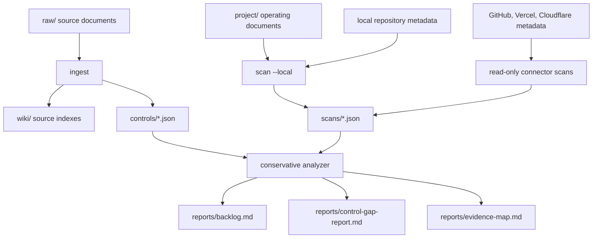

# ISMS-P Agent

ISMS-P Agent is an open source, CLI-first ISMS-P readiness assistant for startup SaaS teams preparing for certification readiness work.

The MVP helps a team turn source material, operating documents, repository metadata, and read-only SaaS metadata into practical next steps:

- a remediation backlog,
- a control gap report,
- an evidence map that lists candidate evidence only.

It does not create final audit evidence, mutate SaaS settings, store secrets, collect customer data, or replace human control-owner review.

## Implementation Approach

- Markdown wiki: source-oriented notes and generated source indexes stay readable and reviewable.
- JSON control model: ingested controls are structured for deterministic analysis and report generation.
- Read-only scanners: local repo, local operating documents, GitHub, Vercel, and Cloudflare collectors produce metadata signals without applying changes.
- Conservative analyzer: missing or failed scanner coverage becomes `needs_confirmation` instead of a false pass.
- Markdown reports: generated outputs are simple files that can be reviewed, versioned, and edited outside the tool.

## Architecture Flow



The intended flow is:

1. Keep official and user-provided sources under `raw/`.
2. Ingest Markdown sources into `controls/` JSON and `wiki/` source indexes with provenance.
3. Scan local files and optional SaaS metadata in read-only mode.
4. Generate Markdown reports that separate observed state, uncertainty, gaps, and candidate evidence.

## MVP Workflow

```bash
npm install
npm run build
npm test
npm link
isms-agent init
isms-agent ingest raw/example.md
isms-agent scan --local
isms-agent report
```

Generated workspace directories:

```text
raw/          immutable source documents
wiki/         generated source indexes and knowledge notes
controls/     structured control JSON
project/      service context and operating documents
connectors/   connector configuration notes
scans/        scanner JSON outputs
reports/      Markdown backlog, gap report, and evidence map
```

## Safety Model

Read [docs/security-model.md](docs/security-model.md) before using the CLI with real service material.

Key defaults:

- connectors are read-only,
- secrets are not stored,
- customer records and personal data are out of scope,
- source provenance is required for generated control knowledge,
- human approval is required before treating candidate evidence as certification-ready evidence.
