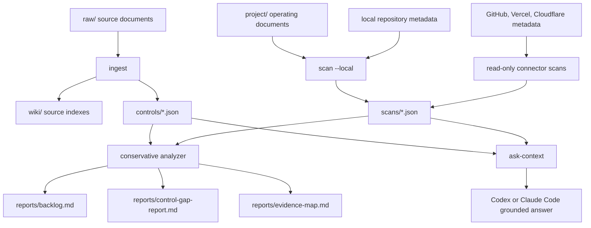

# ISMS-P Agent

ISMS-P Agent is an open source, CLI-first ISMS-P readiness assistant for startup SaaS teams preparing for certification readiness work.

The MVP helps a team turn source material, operating documents, repository metadata, and read-only SaaS metadata into practical next steps:

- a remediation backlog,
- a control gap report,
- an evidence map that lists candidate evidence only.

It does not create final audit evidence, mutate SaaS settings, store secrets, collect customer data, or replace human control-owner review.

## Implementation Approach

- Markdown wiki: source-oriented notes and generated source indexes stay readable and reviewable.
- JSON control model: ingested controls are structured for deterministic analysis and report generation.
- Read-only scanners: local repo, local operating documents, GitHub, Vercel, and Cloudflare collectors produce metadata signals without applying changes.
- Conservative analyzer: missing or failed scanner coverage becomes `needs_confirmation` instead of a false pass.
- Markdown reports: generated outputs are simple files that can be reviewed, versioned, and edited outside the tool.

## Architecture Flow



The intended flow is:

1. Keep official and user-provided sources under `raw/`.
2. Ingest Markdown sources into `controls/` JSON and `wiki/` source indexes with provenance.
3. Scan local files and optional SaaS metadata in read-only mode.
4. Generate Markdown reports that separate observed state, uncertainty, gaps, and candidate evidence.

## MVP Workflow

```bash
npm install
npm run build
npm test
npm link
isms-agent init
isms-agent ingest raw/example.md
isms-agent scan --local
isms-agent report
isms-agent ask-context "2.5.3 사용자 인증 상태 알려줘"
```

Generated workspace directories:

```text
raw/          immutable source documents
wiki/         generated source indexes and knowledge notes
controls/     structured control JSON
project/      service context and operating documents
connectors/   connector configuration notes
scans/        scanner JSON outputs
reports/      Markdown backlog, gap report, and evidence map
```

## Natural-Language Questions with Agents

The CLI does not need a separate LLM API key for natural-language answers. Instead, it exposes a grounded context bundle that Codex, Claude Code, or another local coding agent can read and turn into an answer.

```bash
isms-agent ask-context "2.5.3 사용자 인증 상태 알려줘"
isms-agent ask-context "이번 주 먼저 처리할 항목은?" --markdown
isms-agent ask-context "사용자 인증 증적은 무엇이 부족해?"
```

Default output is JSON for agent callers. `--markdown` prints the same context in a compact human-readable form.

The command is read-only. It reuses the existing conservative analyzer, returns candidate evidence only, and includes answer constraints so the calling agent does not claim certification readiness from evidence existence alone.

## Control Knowledge Pack v0

The first curated pack is `packs/isms-p-core-v0`. It uses the local OpenKB ISMS-P workspace as the source of truth and includes three controls:

- `ISMS-P-2.5.3 사용자 인증`
- `ISMS-P-2.5.6 접근권한 검토`
- `ISMS-P-2.10.2 클라우드 보안`

Until `isms-agent pack install` exists, copy the controls into a workspace manually:

```bash
mkdir -p /path/to/workspace/controls
cp -n packs/isms-p-core-v0/controls/*.json /path/to/workspace/controls/
cd /path/to/workspace
isms-agent scan --local
isms-agent report
isms-agent ask-context "ISMS-P-2.10.2 클라우드 보안에서 부족한 증적은?"
```

If files already exist, review them before replacing local workspace controls.

`ISMS-P-2.5.6 접근권한 검토` is modeled as a deleted residual-risk control. The CLI should ask for residual-risk review, not treat it as a normal active-control gap.

## Safety Model

Read [docs/security-model.md](docs/security-model.md) before using the CLI with real service material.

Key defaults:

- connectors are read-only,
- secrets are not stored,
- customer records and personal data are out of scope,
- source provenance is required for generated control knowledge,
- human approval is required before treating candidate evidence as certification-ready evidence.
