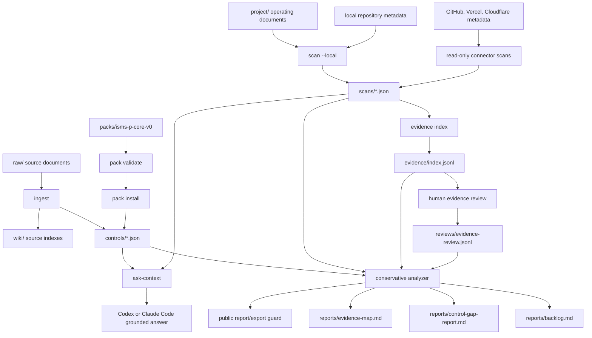

# ISMS-P Agent

ISMS-P Agent is an open-source, CLI-first ISMS-P readiness assistant for startup SaaS teams preparing for certification work.

This repository is an **early preview**. It is intended to show the project direction, architecture, safety model, and contribution surface for community review. It does not certify a service, create final audit evidence, replace an auditor, or replace a human control owner.

The package is marked `private` in `package.json`. The current release posture is source-first public collaboration, not npm publication or a hosted SaaS product.

The MVP helps a team turn source material, operating documents, repository metadata, and read-only SaaS metadata into practical next steps:

- a remediation backlog,
- a control gap report,
- an evidence map that lists candidate evidence only.

It does not create final audit evidence, mutate SaaS settings, store secrets, collect customer data, or publish private evidence.

## Quickstart

Use Node.js 22 or later.

```bash
git clone https://github.com/<owner>/isms-p-agent.git
cd isms-p-agent
npm ci
npm run build
npm test
npm link
```

Validate the bundled public control pack:

```bash
ismsp pack validate packs/isms-p-core-v0
```

Run the synthetic end-to-end sample:

```bash
ismsp init
ismsp pack install packs/isms-p-core-v0
ismsp scan --local --target examples/e2e-sample
ismsp evidence index
ismsp report --public
ismsp evidence export-public
ismsp evidence validate --public
```

Ask a local coding agent to answer from the grounded context bundle:

```bash
ismsp ask-context "What ISMS-P gaps should we handle first?" --markdown
```

The `ask-context` command does not call an LLM API. It prepares conservative context so Codex, Claude Code, or another local agent can answer without treating candidate evidence as certification-ready evidence.

`ismsp` is the primary CLI command. `isms-agent` remains available as a backwards-compatible alias when the package is linked or installed.

## Implementation Approach

- Markdown wiki: source-oriented notes and generated source indexes stay readable and reviewable.
- JSON control model: ingested controls are structured for deterministic analysis and report generation.
- Read-only scanners: local repo, local operating documents, GitHub, Vercel, and Cloudflare collectors produce metadata signals without applying changes.
- Conservative analyzer: missing or failed scanner coverage becomes `needs_confirmation` instead of a false pass.
- Markdown reports: generated outputs are simple files that can be reviewed, versioned, and edited outside the tool.

## Architecture Flow



The intended flow is:

1. Keep official and user-provided sources under `raw/`.
2. Ingest Markdown sources into `controls/` JSON and `wiki/` source indexes with provenance.
3. Scan local files and optional SaaS metadata in read-only mode.
4. Convert scanner signals into candidate evidence IDs with `evidence index`.
5. Record human review decisions in the append-only review overlay.
6. Generate Markdown reports that separate observed state, uncertainty, gaps, candidate evidence, and accepted review decisions.
7. Use public validation/export commands before publishing any example output.

## CLI Workflow

```bash
npm ci
npm run build
npm test
npm link
ismsp pack validate packs/isms-p-core-v0
ismsp init
ismsp ingest raw/example.md
ismsp scan --local
ismsp scan --local --target project/sample-service
ismsp scan --local --target project/sample-service --include app,services,repositories,db,lib,specs --exclude __tests__
ismsp scan --cloudflare example.com
ismsp scan \
  --cloudflare example.com \
  --cloudflare-account account_123 \
  --cloudflare-products zone,access,waf,dns,workers,r2,hyperdrive,api-gateway
ismsp evidence index
ismsp evidence review ev_scan_local_docs_auth_mfa \
  --requirement ISMS-P-2.5.3.admin-mfa \
  --decision needs_followup \
  --rationale "Production enforcement record is still required."
ismsp report
ismsp report --public
ismsp evidence export-public
ismsp evidence validate --public
ismsp ask-context "2.5.3 사용자 인증 상태 알려줘"
```

Generated workspace directories:

```text
raw/          immutable source documents
wiki/         generated source indexes and knowledge notes
controls/     structured control JSON
project/      service context and operating documents
connectors/   connector configuration notes
scans/        scanner JSON outputs
reports/      Markdown backlog, gap report, and evidence map
evidence/     private evidence pointers and redacted public samples
reviews/      human review overlays for evidence and applicability
```

Use `--target <path>` when the workspace contains multiple services or copied repositories. Local scanner paths remain relative to the ISMS-P workspace root, but file discovery is limited to the target directory. Use `--include` and `--exclude` with comma-separated, target-relative paths to narrow the scan to source, specs, or operating documents. The scanner also skips common dependency, build, report, planning/cache, and agent-runtime directories such as `node_modules`, `.next`, `.open-next`, `.planning`, `.claude`, `.playwright-mcp`, `scans`, and `reports`.

Cloudflare scans require `CLOUDFLARE_API_TOKEN` and are read-only. Zone-only scans keep the legacy shape:

```bash
CLOUDFLARE_API_TOKEN=... ismsp scan --cloudflare example.com
```

Account product scans are opt-in:

```bash
CLOUDFLARE_API_TOKEN=... ismsp scan \
  --cloudflare example.com \
  --cloudflare-account account_123 \
  --cloudflare-products zone,access,waf,dns,workers,r2,hyperdrive,api-gateway
```

Cloudflare connector output is candidate metadata, not accepted audit evidence. It records product availability, counts, permission status, and requirement mappings only. Continue through the evidence review flow before using it in readiness decisions:

```bash
ismsp evidence index
ismsp evidence review-cloudflare \
  --decision needs_followup \
  --reviewer security-owner
ismsp evidence validate --public
```

`review-cloudflare` is a bulk overlay for Cloudflare scanner output. It marks configuration snapshots as `needs_followup` by default and writes one private review record per supported requirement. Bulk review can record only `needs_followup` or an explicit `rejected` decision for Cloudflare scanner output; it cannot create `accepted` decisions. Use `ismsp evidence review <evidence-id>` only after a human owner confirms operating evidence such as an access review, change approval, or dated cloud security review.

Accepted Cloudflare evidence is a manual operating-evidence decision. Before recording `--decision accepted`, use the private templates in [docs/evidence-templates/cloudflare/](docs/evidence-templates/cloudflare/) to confirm accepted criteria, private storage, and public export rules. Scanner output alone is not enough to accept ISMS-P-2.10.2 operating evidence.

Accepted decisions must reference an existing local private evidence file or directory under `evidence/private/`:

```bash
ismsp evidence review ev_cloudflare_security_review_2026_q2 \
  --requirement ISMS-P-2.10.2.cloudflare-config-export \
  --decision accepted \
  --private-evidence evidence/private/ISMS-P-2.10.2/security-review/2026-Q2.md \
  --rationale "Private Cloudflare security review confirmed by the security owner." \
  --reviewer security-owner
```

Keep the private file path out of `evidence/index.jsonl` locators. Use a public-safe locator such as an internal reference ID, and let the accepted review record carry the private path through `--private-evidence`.

Manual operating evidence can be registered without exposing private paths:

```bash
ismsp evidence add \
  --id ev_manual_auth_policy_2026_q2 \
  --title "Authentication policy 2026 Q2" \
  --type policy_document \
  --classification internal \
  --supports ISMS-P-2.5.3.authentication-policy \
  --private-evidence evidence/private/ISMS-P-2.5.3/authentication-policy/2026-Q2.md \
  --summary "Authentication policy reviewed for 2026 Q2."
```

`evidence add` does not create or approve evidence. It registers an existing private file or directory as `needs_review` metadata. Use `evidence review --decision accepted --private-evidence ...` only after a human control owner confirms the evidence.

See [docs/connectors/cloudflare.md](docs/connectors/cloudflare.md) for the current endpoint matrix, least-privilege token shape, omitted-field rules, and sample service dry-run flow.

## Natural-Language Questions with Agents

The CLI does not need a separate LLM API key for natural-language answers. Instead, it exposes a grounded context bundle that Codex, Claude Code, or another local coding agent can read and turn into an answer.

```bash
ismsp ask-context "2.5.3 사용자 인증 상태 알려줘"
ismsp ask-context "이번 주 먼저 처리할 항목은?" --markdown
ismsp ask-context "사용자 인증 증적은 무엇이 부족해?"
```

Default output is JSON for agent callers. `--markdown` prints the same context in a compact human-readable form.

The command is read-only. It reuses the existing conservative analyzer, returns candidate evidence only, and includes answer constraints so the calling agent does not claim certification readiness from evidence existence alone.

## Private Evidence and Public Safety

Evidence found by scanners is candidate evidence only. Real service evidence should stay in the local workspace and should not be committed to the public repository.

`ismsp init` creates private evidence directories and default ignore rules:

```text
evidence/private/  real evidence files, ignored by default
evidence/redacted/ optional sanitized examples
reviews/           human review overlay records, ignored by default
```

Run the public safety gate before publishing examples or reports:

```bash
ismsp evidence export-public
ismsp report --public
ismsp evidence validate --public
```

The validator fails when private evidence, scans, reports, or review overlays are tracked by git, or when public evidence metadata contains unsafe classifications or credential-like values. `report --public` and `evidence export-public` omit locators, raw payloads, source excerpts, private paths, and review rationale.

Public examples in this repository must be synthetic or explicitly redacted. Do not contribute real access exports, screenshots, production scans, policy documents, customer records, private paths, account IDs, or secrets.

## Control Knowledge Pack v0

The first curated pack is `packs/isms-p-core-v0`. It uses the local OpenKB ISMS-P workspace as the source of truth and includes eight controls.

The direct pack sources are OpenKB `compiled/controls`, `compiled/citations`, `compiled/evidence`, and public `wiki` notes. Raw legal profile rows such as `raw/legal/7의2...` are kept only as source-profile cross-check references because their numbering can differ from the compiled OpenKB control IDs.

- `ISMS-P-2.5.3 사용자 인증`
- `ISMS-P-2.5.6 접근권한 검토`
- `ISMS-P-2.10.2 클라우드 보안`

Contributors can improve reviewed controls through source-traceable pull requests. See [docs/control-pack-contributions.md](docs/control-pack-contributions.md) for source reference rules, judgment-basis discipline, and validation commands.

### Generating Draft Packs from OpenKB

Maintainers can generate a draft pack from a local OpenKB root:

```bash
ismsp pack generate \
  --openkb /path/to/09_보안_ISMS-P_openkb \
  --pack packs/isms-p-core-v1 \
  --controls ISMS-P-2.5.3,ISMS-P-2.5.6

ismsp pack validate packs/isms-p-core-v1
```

Generated packs are draft knowledge. Every generated control starts with `review_status: needs_human_review`, uses compiled/wiki OpenKB sources as direct source refs, and keeps `raw/legal/*` rows as cross-check references only.

Validate the pack before copying it into a workspace:

```bash
ismsp pack validate
ismsp pack validate packs/isms-p-core-v0
```

The validator rejects public-pack safety problems such as private overlay paths, raw legal profile rows used as direct `source_refs`, mismatched `pack.json` control lists, missing compiled OpenKB references, and deleted controls that are not modeled as human-reviewed residual risk.

Install a curated pack into a workspace before generating reports:

```bash
ismsp pack install packs/isms-p-core-v0
ismsp scan --local
ismsp evidence index
ismsp report
```

Use `--overwrite` only when you intentionally want curated pack controls to replace local workspace controls:

```bash
ismsp pack install packs/isms-p-core-v0 --overwrite
```

`pack install` validates the pack first, then copies public control JSON files into `controls/`. `installedControls` means controls that are now present and up to date after the install, including pre-existing files that already matched the pack. `skippedControls` means existing local files were preserved because they differ from the pack and `--overwrite` was not requested.

If files already exist, review them before replacing local workspace controls.

`ISMS-P-2.5.6 접근권한 검토` is modeled as a deleted residual-risk control. The CLI should ask for residual-risk review, not treat it as a normal active-control gap.

## Safety Model

Read [docs/security-model.md](docs/security-model.md) before using the CLI with real service material.

Key defaults:

- connectors are read-only,
- secrets are not stored,
- customer records and personal data are out of scope,
- source provenance is required for generated control knowledge,
- human approval is required before treating candidate evidence as certification-ready evidence.

## Korean Summary

ISMS-P Agent는 ISMS-P 인증 준비를 돕는 로컬 우선 CLI입니다. 현재 공개 저장소는 early preview이며, 프로젝트 방향성, 아키텍처, 통제항목 팩, 증적 안전 모델, 기여 방식을 보여주는 것이 목적입니다.

이 도구는 인증을 보장하지 않습니다. 스캐너가 찾은 항목은 후보 증적일 뿐이며, 실제 운영 증적의 수집과 accepted 판단은 조직의 담당자 검토를 거쳐야 합니다. 공개 저장소에는 실제 서비스 증적, 고객정보, 계정 식별자, 토큰, 내부 정책 원문을 올리지 마세요.
