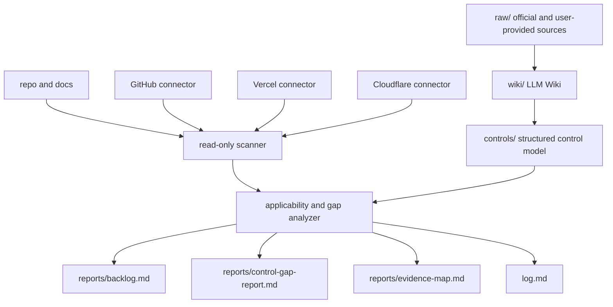

# ISMS-P Agent MVP Design

Date: 2026-05-23

## 1. Purpose

This project is an open source, CLI-first ISMS-P readiness assistant for startups and small SaaS teams that are preparing for ISMS-P for the first time.

The MVP must help a team understand:

- what ISMS-P requires,
- which requirements apply to their SaaS service,
- what the current repo, operating documents, and cloud metadata show,
- which controls are missing or uncertain,
- what work should be done next.

The MVP is not an evidence-packaging tool. Evidence automation comes after the project can correctly explain control intent, applicability, gaps, and operational work.

## 2. Target User

The first target user is a startup or small SaaS team using GitHub, Vercel, and Cloudflare.

Typical users include:

- CTO or technical founder,
- backend or infrastructure lead,
- security owner without a dedicated security team,
- privacy or compliance owner working part-time on certification readiness.

The product should assume the user may not know ISMS-P terminology. It should translate certification controls into practical SaaS operating questions and tasks.

## 3. Non-Goals

The MVP will not:

- automatically generate final audit evidence packages,
- mutate GitHub, Vercel, or Cloudflare settings,
- store secrets, customer data, or personal information,
- claim that a control is fully satisfied from technical configuration alone,
- replace legal, privacy, or certification expert review,
- support AWS, GCP, Azure, on-premise, or enterprise SIEM integrations in the first release,
- provide a hosted multi-tenant SaaS dashboard.

## 4. Product Principles

### Risk-first, evidence-second

The agent must reason in this order:

1. control requirement,
2. control intent,
3. applicable risk,
4. observed current state,
5. gap or uncertainty,
6. recommended operating action,
7. evidence candidate.

Evidence is an output of real control operation. It must not become a substitute for control operation.

### Separate observation from judgment

The agent must distinguish:

- directly observed technical state,
- document-backed operating practice,
- inferred likelihood,
- missing information,
- user-confirmed exception.

For example, enabled GitHub branch protection is an observed technical state. It is not by itself proof that change management is operated.

### Human approval for governance decisions

The agent may draft policies, risk statements, exception rationales, and remediation plans, but final decisions require a human owner.

Examples that require human approval:

- risk acceptance,
- control exception,
- privacy policy content,
- outsourcing and processor decisions,
- access review result,
- incident classification,
- certification scope.

### Read-only by default

GitHub, Vercel, and Cloudflare connectors must be read-only in the MVP.

The tool may recommend settings changes but must not apply them.

### Traceable knowledge

Generated wiki pages and control models must preserve source provenance. Any control explanation, defect pattern, or evidence recommendation should be traceable back to raw sources, user-provided documents, or explicitly marked inference.

## 5. First Supported Stack

The MVP supports:

- GitHub: repository metadata, branch protection, Actions, Dependabot, security settings, secret scanning availability, pull request review configuration, CODEOWNERS, organization/team membership metadata where available.
- Vercel: project metadata, deployment settings, domain and TLS status, environment variable names or presence metadata, team access metadata, deployment history metadata.
- Cloudflare: DNS, TLS, WAF, Access, Workers, Pages, R2, Turnstile, account and zone metadata, audit/logging availability metadata.
- Operating documents: Markdown, exported Notion pages, exported Google Docs, and other local text documents.
- Source repository: code, configuration, dependency manifests, IaC, CI/CD files, authentication/session implementation clues, logging configuration, and environment variable references.

The scanner should be language-aware when possible but should not require a single framework. Next.js, React, and Node.js projects are the first practical assumption.

## 6. Information Architecture

```text
raw/                     # Immutable source documents. The agent must not edit these.
wiki/                    # LLM-maintained ISMS-P knowledge base.
controls/                # Structured control knowledge model.
project/                 # User-provided service input and operating documents.
connectors/              # GitHub, Vercel, and Cloudflare read-only collectors.
scans/                   # Raw scan outputs in JSON.
reports/                 # Human-readable Markdown and HTML reports.
AGENTS.md                # Agent operating rules.
log.md                   # Append-only ingest, scan, and report activity log.
```

## 7. Knowledge Model

Each ISMS-P control should be represented as structured data.

Minimum fields:

```yaml
control_id: "2.5.3"
title: "사용자 인증"
domain: "보호대책 요구사항"
category: "인증 및 권한관리"
requirement: ""
intent: ""
applicability_questions: []
observable_signals: []
required_operating_practices: []
required_evidence: []
common_defects: []
automation_potential: "none | partial | high"
human_review_required: true
source_refs: []
```

The model should support both official control-oriented reporting and startup-friendly execution guidance.

## 8. CLI Commands

### `isms-agent init`

Creates the project structure, starter `AGENTS.md`, empty logs, and default config.

### `isms-agent ingest`

Processes raw ISMS-P sources into wiki pages and structured control data.

Initial supported inputs should be Markdown and PDF. HWP and XLSX support can follow after the core ingest pipeline works reliably.

The ingest workflow should:

- keep raw sources immutable,
- create or update wiki pages,
- update the control model,
- detect contradictions or stale claims,
- append an entry to `log.md`.

### `isms-agent scan`

Collects read-only metadata from configured inputs:

- local repo,
- local operating documents,
- GitHub,
- Vercel,
- Cloudflare.

Scan outputs are JSON files under `scans/`.

The scanner must not store API tokens, secret values, customer records, or personal information. It should prefer metadata, configuration flags, resource names, and presence/absence signals.

### `isms-agent report`

Generates:

- `reports/backlog.md`,
- `reports/control-gap-report.md`,
- `reports/evidence-map.md`.

HTML export can be added once Markdown output is stable.

## 9. Output Model

### Execution Backlog

The default user-facing output is an execution backlog grouped by practical time horizon:

- this week,
- this month,
- before certification readiness review.

Each item should include:

- task,
- reason,
- mapped control IDs,
- owner suggestion,
- priority,
- expected evidence after completion,
- whether human approval is required.

### Control Gap Report

The detailed report is organized by ISMS-P control.

Each control result should include:

```yaml
control_id: "2.5.3"
title: "사용자 인증"
status: "satisfied | partial | gap | not_applicable | needs_confirmation"
observed_evidence: []
missing: []
recommended_actions: []
required_evidence: []
confidence: "low | medium | high"
judgment_basis: "observed | document-backed | inferred | user-confirmed"
source_refs: []
```

### Evidence Map

The evidence map lists candidate evidence, not final audit evidence.

Each row should answer:

- which control it supports,
- where the evidence might come from,
- whether it already exists,
- whether it proves operation or only configuration,
- what additional human review is needed.

## 10. Agent Failure Modes to Prevent

The design must explicitly prevent these behaviors:

- treating evidence existence as control satisfaction,
- treating draft policy text as operational evidence,
- inferring management operation from cloud configuration alone,
- producing shallow scores across all controls without clear basis,
- over-collecting secrets, personal data, or customer data,
- relying on stale law, notification, or KISA source material,
- giving source-free advice,
- recommending enterprise-heavy processes that a small SaaS team cannot operate,
- hiding real gaps behind alternative evidence.

## 11. Architecture



Recommended implementation shape:

- Markdown-first wiki,
- JSON or YAML control model,
- JSON scan outputs,
- Markdown reports first,
- optional HTML reports later,
- no database in the MVP.

This keeps the project easy to inspect, fork, version, and run locally.

## 12. Open Questions for Later

These are intentionally deferred:

- exact implementation language and package manager,
- HWP parsing strategy,
- official source update monitor,
- GitHub Action integration,
- local web UI,
- evidence vault format,
- multi-framework code analysis depth,
- privacy threat modeling assistant,
- consultant-facing review workflow.

## 13. Acceptance Criteria

The MVP design is satisfied when a user can:

1. initialize a local ISMS-P agent workspace,
2. ingest official ISMS-P source material into a traceable wiki and control model,
3. connect or provide GitHub, Vercel, Cloudflare, repo, and document inputs in read-only mode,
4. run a scan without storing secrets or sensitive customer data,
5. generate an execution backlog,
6. generate a control gap report,
7. generate an evidence map,
8. see which conclusions are observed, document-backed, inferred, or still uncertain.
