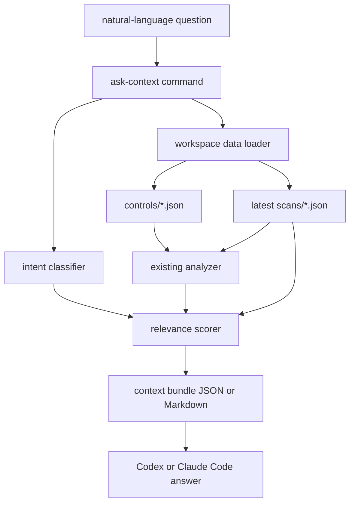

# Agent Ask Context Design

Date: 2026-05-28

## 1. Purpose

`isms-agent ask-context` lets an external coding agent, such as Codex or Claude Code, answer natural-language ISMS-P readiness questions without requiring this CLI to call an LLM API.

The command receives a user's question, reads the local ISMS-P workspace, and emits a grounded context bundle. The bundle is designed to be consumed by an agent that will write the final answer.

The command must not:

- call an LLM provider,
- create new control judgments outside the existing analyzer,
- mutate workspace files,
- collect secrets, source bodies, customer records, or personal data,
- turn candidate evidence into final audit evidence.

## 2. User Flow

```bash
isms-agent ask-context "2.5.3 사용자 인증 상태 알려줘"
isms-agent ask-context "이번 주에 먼저 처리할 ISMS-P 작업은?"
isms-agent ask-context "이 증적이 어떤 통제항목에 연결돼?"
```

Expected use:

1. The service owner initializes, ingests, scans, and reports with the existing commands.
2. Codex or Claude Code runs `isms-agent ask-context "<question>"`.
3. The CLI returns a context bundle with relevant controls, analyses, scan signals, source references, report files, and answer constraints.
4. The external agent writes the natural-language answer using only that bundle and clearly marks uncertainty.

## 3. Command Contract

```bash
isms-agent ask-context <question> [--json] [--markdown]
```

Default output is JSON because agent callers need stable structure. `--json` is explicit and equivalent to the default. `--markdown` provides a human-readable compact view for terminal use.

The command fails clearly when:

- no question is provided,
- both `--json` and `--markdown` are provided,
- `controls/` is empty,
- `scans/` is empty.

## 4. Output Schema

```json
{
  "schemaVersion": 1,
  "generatedAt": "2026-05-28T00:00:00.000Z",
  "question": "2.5.3 사용자 인증 상태 알려줘",
  "intent": "control_status",
  "relevantControls": [
    {
      "control_id": "2.5.3",
      "title": "사용자 인증",
      "status": "partial",
      "confidence": "medium",
      "judgment_basis": "observed",
      "observed_evidence": ["GitHub branch protection is enabled"],
      "missing": ["access review record"],
      "recommended_actions": ["Provide or document evidence for: access review record"],
      "required_evidence": ["access review record"],
      "source_refs": []
    }
  ],
  "relevantSignals": [
    {
      "id": "github-branch-protection",
      "source": "github",
      "basis": "observed",
      "summary": "GitHub branch protection is enabled",
      "paths": [".github/settings.yml"],
      "metadata": { "repository": "owner/repo" }
    }
  ],
  "relevantReports": [
    "reports/control-gap-report.md",
    "reports/evidence-map.md"
  ],
  "facts": [
    "2.5.3 사용자 인증 status is partial with medium confidence.",
    "Observed candidate evidence: GitHub branch protection is enabled.",
    "Missing item: access review record."
  ],
  "answerConstraints": [
    "Do not claim certification readiness from candidate evidence alone.",
    "Separate observed state from document-backed operating practice.",
    "Mark needs_confirmation and missing scanner coverage as uncertainty.",
    "Do not invent evidence or source references not present in this bundle.",
    "Do not include secrets, customer records, or personal data."
  ]
}
```

## 5. Intent Classification

The MVP uses deterministic lexical classification. It is intentionally simple because the external agent can still interpret the returned bundle.

Supported intents:

- `control_status`: asks about one control or a named control topic.
- `backlog`: asks what to do next, this week, this month, or before readiness review.
- `evidence`: asks about evidence, 증적, candidate evidence, or proof.
- `gap_summary`: asks about gaps, missing items, risks, or current weak points.
- `source_trace`: asks where a claim came from or which source supports it.
- `general`: fallback when no stronger intent is found.

Control ID matches have the highest priority. If the question includes `2.5.3`, only that control and directly relevant signals should be prioritized.

## 6. Relevance Rules

Relevance scoring must be deterministic and explainable:

1. Exact control ID match.
2. Control title match.
3. Control model terms match: title, requirement, intent, observable signals, operating practices, required evidence, common defects.
4. Analyzer output match: observed evidence, missing items, recommended actions.
5. Scan signal match: summary, paths, and safe metadata values.
6. Intent-specific fallback:
   - `backlog`: prioritize `gap`, `partial`, and `needs_confirmation`.
   - `evidence`: prioritize controls with required evidence and observed candidate evidence.
   - `gap_summary`: prioritize `gap`, then `partial`, then `needs_confirmation`.
   - `source_trace`: prioritize controls with source references.

The output should cap results to a small set so a coding agent receives useful context instead of the entire workspace. The MVP cap is five controls and ten scan signals.

## 7. Architecture



`ask-context` depends on the same analyzer as `report`. That keeps the command conservative: it can expose current status and uncertainty, but it does not add a second judgment engine.

## 8. Safety Rules

- The command is read-only.
- The command does not read raw source bodies or local project file bodies.
- The command only uses already structured controls and scan results.
- Metadata already collected by scanners is passed through unchanged.
- The final answer constraints are emitted on every response.
- `facts` must be generated from current analyzer output and scan summaries only.

## 9. Testing

Automated tests should cover:

- control ID questions return the matching control first,
- Korean evidence questions classify as `evidence`,
- backlog questions prioritize `gap`, `partial`, and `needs_confirmation`,
- no controls or no scans produce clear errors,
- Markdown output includes constraints and candidate-evidence language,
- CLI usage includes `ask-context`.

## 10. Acceptance Criteria

- `isms-agent ask-context "<question>"` returns deterministic JSON.
- `isms-agent ask-context "<question>" --markdown` returns deterministic Markdown.
- The implementation reuses the existing analyzer.
- The command is read-only and writes no files.
- `npm test`, `npm run check`, and `git diff --check` pass.
