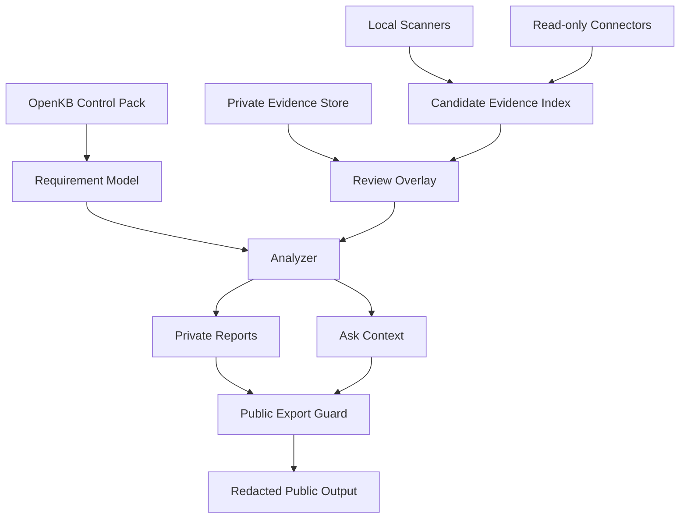

# Private Evidence Store and Review Overlay Design

Date: 2026-05-28

## 1. Decision

The ISMS-P Agent must not scale by attaching real evidence files directly to each control or by storing private evidence in the public open source repository.

The next capability should introduce a local-first private evidence layer between scanner output and analyzer reports:

1. Control Knowledge Packs remain public and source-of-truth aligned with OpenKB.
2. Real service evidence remains in a local private workspace by default.
3. Scanner output creates candidate evidence only.
4. A human review overlay accepts, rejects, or requests follow-up for candidate evidence.
5. Public export commands must redact or omit private evidence, private paths, secrets, and personal data.

This design exists to prevent two failure modes:

- scale failure: each new ISMS-P control creates unmanaged manual evidence sprawl,
- safety failure: sensitive operating evidence is accidentally committed to the open source project.

## 2. Purpose

The current analyzer can identify candidate evidence from repository signals, local documents, and connector metadata. That is useful for the first three controls, but it is not sufficient once the pack grows to dozens of controls.

The system needs a durable model for:

- mapping one evidence item to many controls,
- mapping controls to smaller requirement-level checks,
- tracking evidence classification and lifecycle,
- distinguishing accepted evidence from candidate evidence,
- keeping private evidence out of public artifacts,
- making future connector output reviewable instead of automatically trusted.

The CLI should help a team manage readiness work, not silently turn "found a file" into "control satisfied."

## 3. Scope

In scope:

- local private evidence registry,
- evidence review overlay,
- requirement-level evidence mapping,
- public export guard,
- report and ask-context integration,
- validation rules that fail when private evidence is unsafe to publish,
- workspace defaults that gitignore private evidence.

Out of scope for the first implementation:

- hosted evidence vault,
- uploading evidence to a remote service,
- final auditor submission workflow,
- automatic redaction of arbitrary file bodies,
- binary evidence OCR,
- mutation of SaaS or cloud settings,
- claiming certification readiness from accepted evidence alone.

## 4. Architecture



The core rule is that raw evidence does not flow directly into public reports. Reports use evidence IDs, classifications, summaries, hashes, and review decisions.

## 5. Workspace Layout

`isms-agent init` should eventually create this layout:

```text
raw/                 public or user-curated source documents
wiki/                generated source indexes
controls/            structured control JSON
project/             local service context selected by the user
connectors/          connector configuration notes
scans/               private scan outputs
reports/             private reports
evidence/
  private/           real evidence files, never committed
  redacted/          optional sanitized examples
reviews/
  evidence-review.jsonl
  applicability.jsonl
```

The default generated `.gitignore` should include:

```gitignore
/evidence/private/
/reviews/
/scans/
/reports/
*.secret.*
*.private.*
```

The public repository may include redacted fixtures and examples, but never real private evidence.

## 6. Data Model

### 6.1 Requirement

A requirement is a finer-grained check under a control. Controls remain the certification-facing unit; requirements are the analyzer-facing unit.

```ts
export interface ControlRequirement {
  requirement_id: string;
  control_id: string;
  title: string;
  kind: "policy" | "configuration" | "operation_record" | "implementation" | "log" | "applicability";
  required: boolean;
  evidence_types: EvidenceType[];
  review_frequency?: "per_change" | "monthly" | "quarterly" | "semiannual" | "annual";
  freshness_days?: number;
  source_refs: SourceRef[];
}
```

Example IDs:

```text
ISMS-P-2.5.3.auth-policy
ISMS-P-2.5.3.session-timeout
ISMS-P-2.5.3.failed-login-limit
ISMS-P-2.5.3.admin-mfa
ISMS-P-2.5.3.abnormal-login-review
ISMS-P-2.10.2.cloud-responsibility-matrix
ISMS-P-2.10.2.cloudflare-config-export
ISMS-P-2.10.2.cloud-admin-access-review
ISMS-P-2.10.2.cloud-change-approval
ISMS-P-2.5.6.deleted-control-residual-risk
```

### 6.2 Evidence Item

An evidence item is a stable pointer to an artifact or signal. It can support multiple requirements and controls.

```ts
export type EvidenceType =
  | "policy_document"
  | "procedure_document"
  | "configuration_export"
  | "access_review_record"
  | "change_approval_record"
  | "audit_log"
  | "implementation_file"
  | "test_result"
  | "connector_snapshot"
  | "applicability_note";

export type EvidenceClassification =
  | "public_sample"
  | "internal"
  | "confidential"
  | "secret"
  | "personal_data";

export type EvidenceLifecycleStatus =
  | "candidate"
  | "needs_review"
  | "accepted"
  | "rejected"
  | "expired"
  | "superseded";

export interface EvidenceItem {
  evidence_id: string;
  title: string;
  evidence_type: EvidenceType;
  classification: EvidenceClassification;
  lifecycle_status: EvidenceLifecycleStatus;
  origin: "scan" | "connector" | "manual" | "redacted_sample";
  supports: string[];
  locator: EvidenceLocator;
  summary: string;
  content_sha256?: string;
  collected_at: string;
  valid_until?: string;
  review_required: boolean;
  metadata: Record<string, string | number | boolean | string[]>;
}

export interface EvidenceLocator {
  kind: "workspace_path" | "external_reference" | "scan_signal" | "connector_snapshot";
  value: string;
}
```

`supports` contains requirement IDs, not only control IDs. A single Cloudflare configuration snapshot can support several requirements.

### 6.3 Review Overlay

The review overlay is append-only JSONL. It records human judgment without rewriting scanner output.

```ts
export type ReviewDecision = "accepted" | "rejected" | "needs_followup";

export interface EvidenceReviewRecord {
  schemaVersion: 1;
  reviewed_at: string;
  evidence_id: string;
  requirement_id: string;
  decision: ReviewDecision;
  reviewer?: string;
  rationale: string;
  conditions?: string[];
  expires_at?: string;
  replacement_evidence_id?: string;
}
```

Rules:

- scanner output is immutable input,
- reviews can supersede previous reviews by timestamp,
- accepted evidence can still expire,
- rejected evidence must not count toward control readiness,
- needs-follow-up evidence must keep the requirement partial or needs_confirmation.

## 7. Command Design

### 7.1 Evidence Index

```bash
isms-agent evidence index
isms-agent evidence index --from-scan scans/local-2026-05-28T14-09-01-625Z.json
```

Creates or refreshes candidate evidence items from scan signals. It should not read private file bodies unless a later explicit import command is added.

Output:

```text
evidence/index.jsonl
```

### 7.2 Evidence Review

```bash
isms-agent evidence review <evidence-id> \
  --requirement ISMS-P-2.5.3.admin-mfa \
  --decision accepted \
  --rationale "Auth spec, code, and settings UI show MFA support; production enforcement still needs owner review."
```

The command appends to:

```text
reviews/evidence-review.jsonl
```

### 7.3 Evidence Validate

```bash
isms-agent evidence validate
isms-agent evidence validate --public
```

Validation rules:

- fail if `evidence/private/`, `reviews/`, `scans/`, or `reports/` files are git tracked,
- fail public validation if `classification` is `secret` or `personal_data`,
- fail public validation if a public artifact contains private absolute paths,
- fail public validation if metadata contains credential-like values,
- warn when accepted evidence is expired,
- warn when evidence has no requirement mapping,
- warn when a requirement has only candidate evidence and no review decision.

### 7.4 Public Export

```bash
isms-agent report --public
isms-agent evidence export-public
```

Public mode must:

- omit private local paths,
- omit file bodies,
- omit connector raw payloads,
- include only evidence IDs, redacted titles, classifications, and safe summaries,
- include "candidate evidence only" language unless a human-reviewed public sample exists.

## 8. Analyzer Integration

The analyzer should move from control-level matching to requirement-level evaluation.

MVP logic:

1. Load controls.
2. Expand controls into requirements.
3. Load latest scan signals.
4. Load evidence index.
5. Load latest review decisions.
6. Evaluate each requirement:
   - `met`: accepted, current evidence exists,
   - `candidate`: candidate evidence exists but not accepted,
   - `needs_followup`: latest review asks for follow-up,
   - `missing`: no matching evidence,
   - `expired`: accepted evidence exists but is stale,
   - `not_applicable`: applicability review says not applicable.
7. Roll requirement status up to control status:
   - `satisfied`: all required requirements are met,
   - `partial`: at least one required requirement is candidate, needs_followup, or expired,
   - `gap`: at least one required requirement is missing and scope is applicable,
   - `needs_confirmation`: scanner or applicability coverage is insufficient,
   - `not_applicable`: all required requirements are not applicable.

Accepted evidence should raise confidence, but it should not remove the human-review warning from reports.

## 9. Report Changes

Private reports should show:

- control status,
- requirement-level status,
- accepted evidence IDs,
- candidate evidence IDs,
- missing requirements,
- expired evidence,
- review rationale,
- next action.

Public reports should show:

- control status only if safe,
- requirement status without private path detail,
- redacted evidence IDs and safe summaries,
- no private file paths,
- no connector raw payloads,
- no secrets or personal data.

Example private report row:

```text
Requirement: ISMS-P-2.5.3.admin-mfa
Status: candidate
Candidate evidence:
- ev_scan_local_auth_mfa_001, confidential, project/evaluation/specs/Auth_Spec.md
Review: needs_followup, production enforcement evidence required
Next action: attach owner-approved MFA configuration record
```

Example public report row:

```text
Requirement: ISMS-P-2.5.3.admin-mfa
Status: candidate
Evidence: redacted evidence summary available
Private detail: omitted
```

## 10. Public Repository Safety

The open source repository should include:

- control pack templates,
- schemas,
- scanner and analyzer code,
- redacted fixtures,
- sample review overlays with fake data,
- documentation.

The open source repository should not include:

- real `evidence/private` contents,
- real connector scan outputs,
- real private reports,
- customer records,
- employee or admin account data,
- tokens, secrets, database URLs, private keys,
- unredacted cloud configuration exports.

CI should eventually run:

```bash
npm test
npm run check
isms-agent pack validate
isms-agent evidence validate --public
```

## 11. First Implementation Slice

The first implementation PR should be intentionally narrow:

1. Add evidence schemas.
2. Update `init` to create `evidence/private`, `evidence/redacted`, and `reviews`.
3. Update `init` to write the private evidence `.gitignore` rules.
4. Add `evidence validate --public` with git-tracked private path detection and simple secret-like metadata detection.
5. Add fixture evidence index and review overlay files.
6. Update reports to mention review overlay status when present.
7. Add tests for:
   - accepted review record is read,
   - rejected evidence does not count,
   - expired evidence is flagged,
   - public validation rejects private tracked paths,
   - public report omits private paths.

The first slice should not add Cloudflare or GitHub connector expansion. Those should come after the evidence safety layer exists.

## 12. Acceptance Criteria

- Real evidence can be represented by ID and classification without copying contents into reports.
- One evidence item can support multiple requirement IDs.
- Candidate evidence and accepted evidence are visibly different in reports.
- Public validation prevents private evidence paths from being published.
- Public export omits private paths and unsafe classifications.
- Deleted residual-risk controls, such as `ISMS-P-2.5.6`, can be handled through an applicability or residual-risk evidence requirement.
- The design remains local-first and no-upload-by-default.
