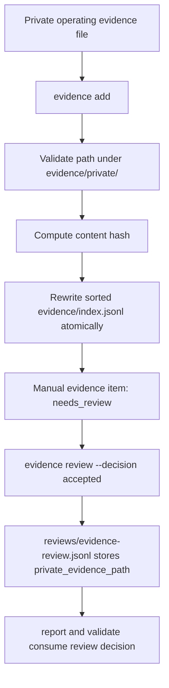

# evidence add Design

## Goal

Add `isms-agent evidence add` so service owners can register manually collected operating evidence without hand-editing `evidence/index.jsonl`.

The command is registration-only in v1. It verifies that a private evidence file or directory already exists under `evidence/private/`, then writes a public-safe manual evidence metadata row to `evidence/index.jsonl`.

## Problem

The current workflow can index scanner output and review existing evidence IDs, but it has no safe CLI path for registering real operating evidence such as:

- authentication policy documents,
- MFA and session configuration records,
- cloud administrator access reviews,
- cloud change approval records,
- log retention review records,
- residual-risk review notes for deleted controls.

Without `evidence add`, users must manually edit `evidence/index.jsonl`. That creates three risks:

- private paths may be copied into public metadata,
- schema fields may drift or be malformed,
- users may confuse "file exists" with "evidence accepted".

## Decision

Implement `evidence add` as a conservative manual evidence registration command.

It must:

- require an existing `--private-evidence evidence/private/...` path,
- reject paths outside the workspace,
- reject paths outside `evidence/private/`,
- reject missing files or directories,
- reject duplicate `evidence_id` values by default,
- require at least one `--supports <requirement-id>` mapping,
- write `origin: "manual"`,
- write `lifecycle_status: "needs_review"`,
- write `review_required: true`,
- store only public-safe metadata in `evidence/index.jsonl`,
- avoid storing the private evidence path in the evidence item.

The private path remains attached only during an accepted human review through:

```bash
isms-agent evidence review <evidence-id> \
  --requirement <requirement-id> \
  --decision accepted \
  --rationale <text> \
  --private-evidence evidence/private/...
```

## CLI Shape

```bash
isms-agent evidence add \
  --id ev_manual_auth_policy_2026_q2 \
  --title "Authentication policy 2026 Q2" \
  --type policy_document \
  --classification internal \
  --supports ISMS-P-2.5.3.authentication-policy \
  --private-evidence evidence/private/ISMS-P-2.5.3/authentication-policy/2026-Q2.md \
  --summary "Authentication policy reviewed for 2026 Q2."
```

Optional fields:

```bash
--valid-until 2026-12-31T14:59:59.000Z
--metadata key=value
```

The command should print the added evidence item and output path as JSON.

## Evidence Item

Example row in `evidence/index.jsonl`:

```json
{
  "evidence_id": "ev_manual_auth_policy_2026_q2",
  "title": "Authentication policy 2026 Q2",
  "evidence_type": "policy_document",
  "classification": "internal",
  "lifecycle_status": "needs_review",
  "origin": "manual",
  "supports": ["ISMS-P-2.5.3.authentication-policy"],
  "locator": {
    "kind": "external_reference",
    "value": "ev_manual_auth_policy_2026_q2"
  },
  "summary": "Authentication policy reviewed for 2026 Q2.",
  "content_sha256": "<sha256-of-private-file-or-directory-manifest>",
  "collected_at": "2026-05-29T00:00:00.000Z",
  "valid_until": "2026-12-31T14:59:59.000Z",
  "review_required": true,
  "metadata": {
    "private_evidence_present": true
  }
}
```

The index row intentionally omits:

- `private_evidence_path`,
- absolute local paths,
- source excerpts,
- credential values,
- customer records,
- person-level access lists.

## Classification Policy

v1 allows:

- `internal`
- `confidential`
- `public_sample`

v1 rejects:

- `secret`
- `personal_data`

Reason: secret and personal-data evidence need a separate high-risk flow with stronger redaction, retention, and public-export behavior. The first implementation should support common operating evidence without creating a path for accidental sensitive-data indexing.

## Type Policy

`--type` must be one of the existing `EvidenceType` values:

- `policy_document`
- `procedure_document`
- `configuration_export`
- `access_review_record`
- `change_approval_record`
- `audit_log`
- `implementation_file`
- `test_result`
- `connector_snapshot`
- `applicability_note`

The command should not introduce new evidence types in this PR.

## Data Flow



`evidence add` does not decide whether the evidence is good enough. It only records that an operator has supplied a candidate manual evidence item.

## Duplicate Handling

Default behavior:

- if `evidence_id` already exists, fail with a clear error,
- do not partially modify `evidence/index.jsonl`.

Write behavior:

- load the current evidence index,
- append the new manual evidence item in memory,
- sort by `evidence_id`,
- write the complete JSONL file in one operation.

No `--overwrite` flag in v1. Updating or superseding evidence should be designed separately because it affects lifecycle, replacement evidence, expiry, and audit trail semantics.

## Content Hashing

For a file:

- compute SHA-256 over the file bytes.

For a directory:

- recursively enumerate files,
- ignore common OS metadata such as `.DS_Store`,
- hash a stable manifest containing relative file path and file hash pairs.

The hash proves the registered private evidence did not silently change between registration and review. The hash is safe to store in public-safe metadata.

## Metadata

`--metadata key=value` is optional and repeatable.

Metadata validation must reuse the public-safety rules already used by `evidence validate --public`:

- reject credential-like keys such as token, secret, password, private key, database URL, API key,
- reject credential-looking values,
- keep values scalar strings in v1.

The command should add `private_evidence_present: true` automatically. It should not add the private path.

## Error Handling

The command fails when:

- required flags are missing,
- `--id` is empty or contains unsafe characters,
- `--supports` is empty,
- `--private-evidence` is absolute,
- `--private-evidence` points outside the workspace,
- `--private-evidence` is not under `evidence/private/`,
- `--private-evidence` does not exist,
- `--classification` is `secret` or `personal_data`,
- metadata is public-unsafe,
- the evidence ID already exists,
- `evidence/index.jsonl` contains invalid JSONL.

Errors should explain the exact field that failed and the safe expected shape.

## Reporting Semantics

After `evidence add`, reports should treat the evidence as candidate or needs-review evidence.

The requirement may move from `missing` to `candidate`, but not to `met`.

The requirement becomes `met` only when `evidence review --decision accepted` records a valid accepted review with `--private-evidence`.

## Public Safety

`evidence validate --public` must remain valid after adding manual evidence when:

- the manual item uses an allowed classification,
- the locator is public-safe,
- metadata has no credential-like values,
- accepted review records reference existing `evidence/private/...` paths.

Public reports and public exports must not reveal the private path or private review rationale.

## Tests

Add focused tests for:

- successful manual evidence add writes a valid item,
- private path is not stored in `evidence/index.jsonl`,
- duplicate evidence IDs are rejected,
- missing private evidence path is rejected,
- outside-workspace path is rejected,
- path outside `evidence/private/` is rejected,
- `secret` and `personal_data` classifications are rejected,
- metadata credential keys or values are rejected,
- `evidence index` preserves manual evidence rows after scanner re-index,
- CLI parsing supports `evidence add`,
- report status remains candidate until accepted review,
- accepted review can reference the same private path and satisfy the requirement.

## Documentation

Update:

- `README.md` with a manual evidence registration example,
- `docs/security-model.md` with the separation between private evidence, index metadata, and accepted review paths.

Documentation must state that `evidence add` does not create or approve evidence. It only registers an already existing private evidence artifact.

## Out of Scope

v1 does not include:

- generating evidence templates,
- creating private evidence files,
- accepting evidence automatically,
- `--overwrite`,
- evidence deletion,
- evidence supersession,
- secret or personal-data evidence flows,
- remote storage upload,
- SaaS mutation,
- reading customer records.

## Acceptance Criteria

- `isms-agent evidence add` can register existing private evidence without hand-editing JSONL.
- Private paths are never stored in `evidence/index.jsonl`.
- Added manual evidence survives `isms-agent evidence index`.
- Added manual evidence does not make a requirement `met` until an accepted review exists.
- `isms-agent evidence validate --public` passes for public-safe manual evidence.
- Existing scanner, Cloudflare review, report, and public export behavior remains compatible.
